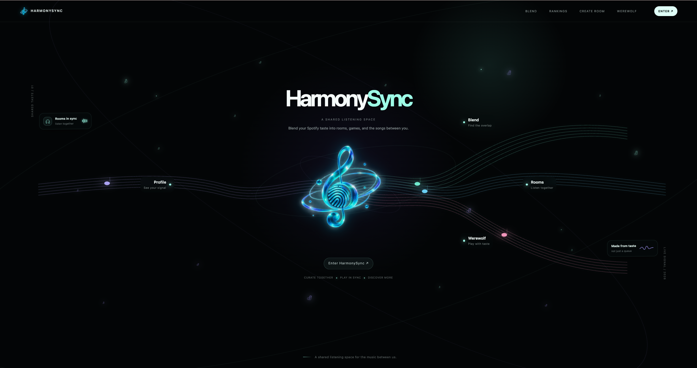
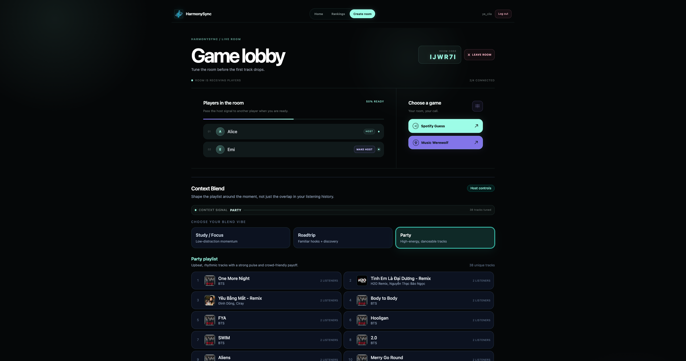
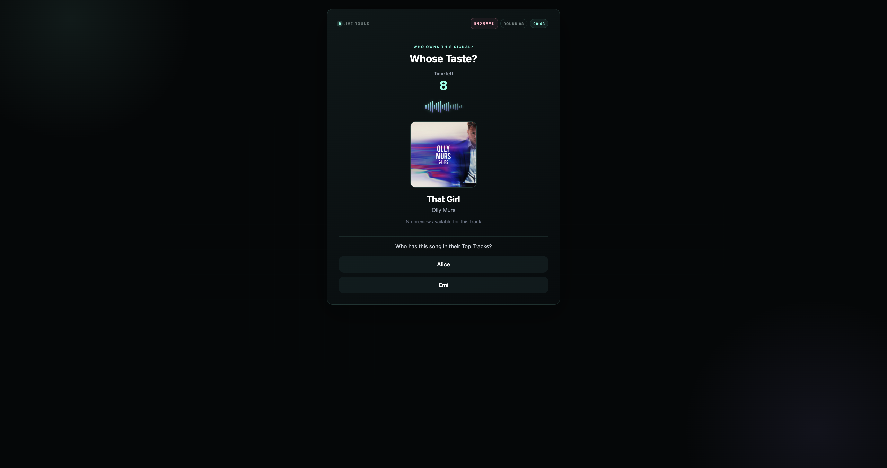
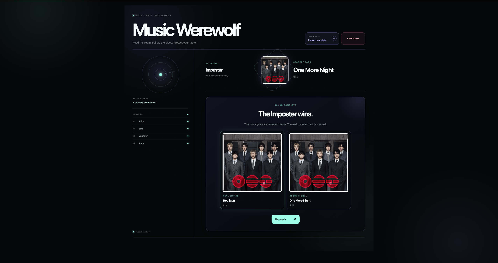
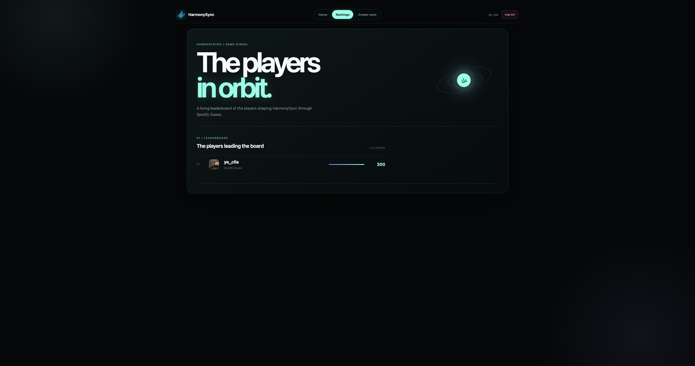

# 🎵 HarmonySync

<p align="center">
  <strong>Your music taste. Your friends. One shared experience.</strong>
</p>

<p align="center">
  A Spotify-powered multiplayer web application where friends connect through music,
  compete in music-based games, and discover how their tastes overlap.
</p>

<p align="center">
  <a href="https://harmony-sync-orpin.vercel.app">
    <strong>🌐 Live Demo</strong>
  </a>
  &nbsp; · &nbsp;
  <a href="https://github.com/ye-cila/HarmonySync-backend">
    Backend
  </a>
</p>

<p align="center">
  
  
  
  
  
  
</p>

---

## ✨ What is HarmonySync?

HarmonySync transforms Spotify listening data into a social multiplayer experience.

Instead of simply showing users their favorite artists and tracks, HarmonySync lets friends bring their music tastes into the same room and compete through interactive music games.

The application combines:

**Spotify OAuth → Spotify listening data → Multiplayer rooms → Real-time games → Persistent scores → Leaderboard**

### 🎯 Core Experience

```text
Connect Spotify
      ↓
Create / Join a Room
      ↓
Meet your friends
      ↓
Choose a music game
      ↓
Play together in real time
      ↓
Earn points
      ↓
Climb the leaderboard
````

---

## 🎮 Features

| Feature                     | Description                                                                        |
| --------------------------- | ---------------------------------------------------------------------------------- |
| **Spotify Integration**  | Authenticate with Spotify and retrieve user profiles, top artists, and top tracks. |
| **Multiplayer Rooms**    | Create or join rooms using a unique room code.                                     |
| **Real-Time Multiplayer** | Synchronize players and game state using Socket.IO.                                |
| **Spotify Guess**        | Test how well players can identify music-related clues.                            |
| **Music Werewolf**       | A social deduction game built around music and hidden roles.                       |
| **Leaderboard**          | Persist game scores and display players' highest scores.                           |
| **Music Compatibility**  | Compare ranked artists between players using ranking-based algorithms.             |
| **Token Refreshing**     | Refresh expired Spotify access tokens through the backend.                         |

---

## 📸 Screenshots

### Home

<p align="center">
  
</p>

### Room Lobby

<p align="center">
  
</p>

### Spotify Guess

<p align="center">
  
</p>

### Music Werewolf

<p align="center">
  
</p>

### Leaderboard

<p align="center">
  
</p>

## 🧠 Technical Highlights

### 1. Real-Time Multiplayer with Socket.IO

Players communicate with the backend through persistent Socket.IO connections.

When a player joins a room, the frontend emits player information to the backend:

```js
socket.emit("join-room", {
  roomCode,
  userId,
  playerName,
  topArtists,
  topTracks
});
```

The backend then broadcasts room updates to connected clients.

This allows multiple browser sessions to stay synchronized without requiring page refreshes.

---

### 2. Artist Ranking with `Map`

HarmonySync uses JavaScript `Map` for efficient artist-rank lookups.

```js
const artistRanks = new Map();

artistRanks.set("Drake", 1);
artistRanks.set("SZA", 2);
artistRanks.set("BTS", 3);
```

Instead of repeatedly searching through an array, artist rankings can be retrieved using approximately **O(1)** average-time lookup.

This data structure is used as part of the music compatibility logic.

---

### 3. Ranking-Based Compatibility

Artist rankings are converted into weighted scores:

```text
weight = N - rank + 1
```

For example, with five ranked artists:

```text
Rank 1 → 5 points
Rank 2 → 4 points
Rank 3 → 3 points
Rank 4 → 2 points
Rank 5 → 1 point
```

Shared artists can then be compared based on how highly each player ranks them.

This provides a foundation for calculating music compatibility between players.

---

### 4. Persistent Game Scores

Game results are stored in PostgreSQL through Supabase.

The current database relationship is:

```text
users
  │
  │ user_id
  ▼
game_scores
  │
  ▼
Leaderboard
```

The leaderboard calculates each player's highest score for a game type.

---

### 5. Spotify OAuth + Token Refresh

Spotify authentication is handled through the backend so sensitive Spotify credentials remain server-side.

```text
User
 │
 ▼
Frontend
 │
 ▼
Backend /login
 │
 ▼
Spotify Authorization
 │
 ▼
Backend /callback
 │
 ▼
Access Token
 │
 ▼
Frontend
 │
 ▼
Spotify Web API
```

When an access token expires, the frontend can request a refreshed token through the backend.

---

## 🛠️ Tech Stack

### Frontend

* React
* Vite
* JavaScript
* CSS
* Socket.IO Client

### Backend

* Node.js
* Express
* Socket.IO
* Axios

### Database

* Supabase
* PostgreSQL

### APIs & Authentication

* Spotify Web API
* Spotify OAuth

### Deployment

* Vercel — Frontend
* Render — Backend
* Supabase — Database

---

## ⚙️ Getting Started

### Prerequisites

Make sure you have:

* Node.js 18+
* npm
* A Spotify account
* A Spotify Developer application
* A running HarmonySync backend

### 1. Clone the Repository

```bash
git clone https://github.com/ye-cila/HarmonySync-frontend.git

cd HarmonySync-frontend
```

### 2. Install Dependencies

```bash
npm install
```

### 3. Configure Environment Variables

Create a `.env` file in the project root:

```env
VITE_BACKEND_URL=http://127.0.0.1:8888
```

> Do not commit `.env` files containing secrets.

### 4. Start the Development Server

```bash
npm run dev
```

The frontend will be available at:

```text
http://127.0.0.1:5173
```

### 5. Start the Backend

The frontend requires the HarmonySync backend to be running.

Backend repository:

[https://github.com/ye-cila/HarmonySync-backend](https://github.com/ye-cila/HarmonySync-backend)

The local backend runs on:

```text
http://127.0.0.1:8888
```

For backend setup instructions, see the backend repository README.

---

## 🌐 Production

HarmonySync is deployed using a separate frontend and backend architecture.

| Service  | Platform | Purpose                |
| -------- | -------- | ---------------------- |
| Frontend | Vercel   | React application      |
| Backend  | Render   | API + Socket.IO server |
| Database | Supabase | PostgreSQL persistence |

### Live Application

[https://harmony-sync-orpin.vercel.app](https://harmony-sync-orpin.vercel.app)

### Backend

[https://harmonysync-backend.onrender.com](https://harmonysync-backend.onrender.com)

---

## 🔒 Security

Environment variables are used to keep sensitive credentials outside the frontend source code.

The frontend only exposes the public backend URL:

```env
VITE_BACKEND_URL
```

Sensitive credentials such as:

* Spotify Client Secret
* Supabase Service Role Key

remain on the backend and are never included in the frontend environment.

> `.env` files should never be committed to the repository.

---

## 🗺️ Roadmap

### Completed

* [x] Spotify OAuth authentication
* [x] Spotify profile integration
* [x] Top artists and tracks
* [x] Multiplayer room creation
* [x] Room joining
* [x] Real-time player synchronization
* [x] Spotify Guess
* [x] Music Werewolf
* [x] Game score persistence
* [x] Global leaderboard
* [x] Supabase integration
* [x] Production deployment

### Future Improvements

* [ ] More music-based multiplayer games
* [ ] More advanced music compatibility algorithms
* [ ] Player statistics
* [ ] Match history
* [ ] Improved matchmaking
* [ ] Expanded Spotify recommendations
* [ ] Additional mobile optimizations

---

## 💡 Why I Built This

I wanted to build a project that combined several areas of software engineering instead of focusing on a single CRUD application.

HarmonySync gave me the opportunity to work with:

* Third-party API integration
* OAuth authentication
* React state management
* REST APIs
* WebSocket communication
* Multiplayer game state
* Data structures and algorithms
* PostgreSQL database design
* Cloud deployment

The project also gave me a practical environment to understand how a frontend, backend, database, and external API work together as one system.

---

## 🤝 Contributing

Contributions are what make the open-source community an amazing place to learn, inspire, and create. Any contributions you make are greatly appreciated.

1. Fork the Project
2. Create your Feature Branch (git checkout -b feature/AmazingFeature)
3. Make your changes
4. Commit your Changes (git commit -m 'Add some AmazingFeature')
5. Push to the Branch (git push origin feature/AmazingFeature)
6. Open a Pull Request

---

## 👩🏻‍💻 Author

**Alice Nguyen** - [LinkedIn](https://www.linkedin.com/in/alice-nguyen-b62ba2385/) - alicephgthao@gmail.com

**Project Link:** [HarmonySync](https://github.com/ye-cila/HarmonySync)

---

<p align="center">
  <strong>HarmonySync</strong>
  <br />
  Built with 🎵 and ☕
</p>
